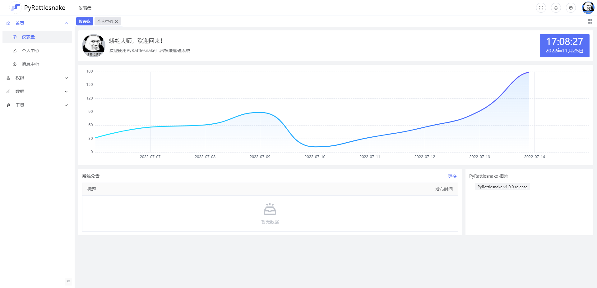
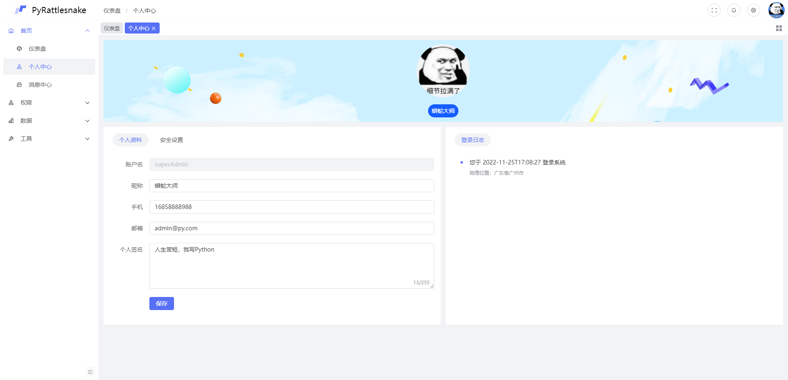
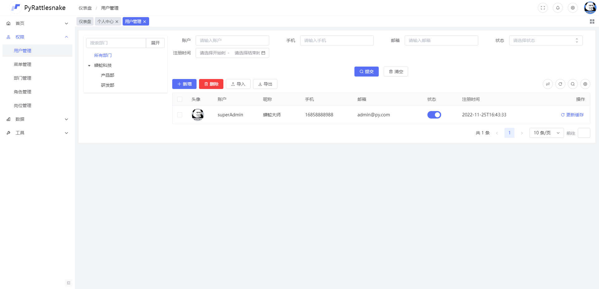
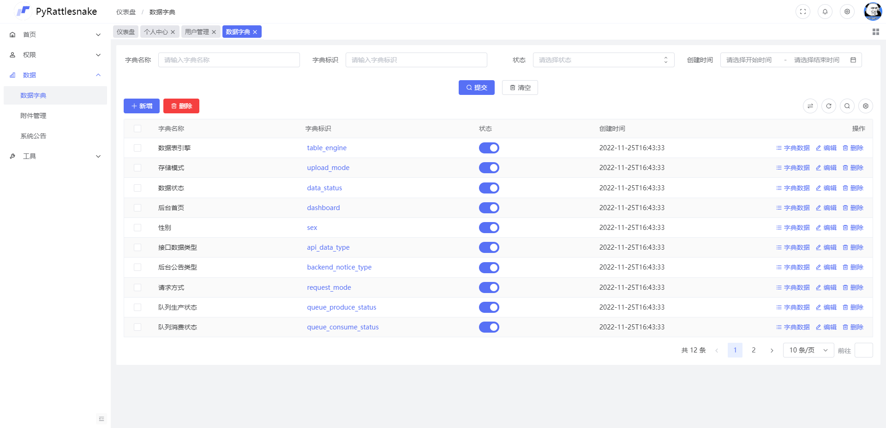
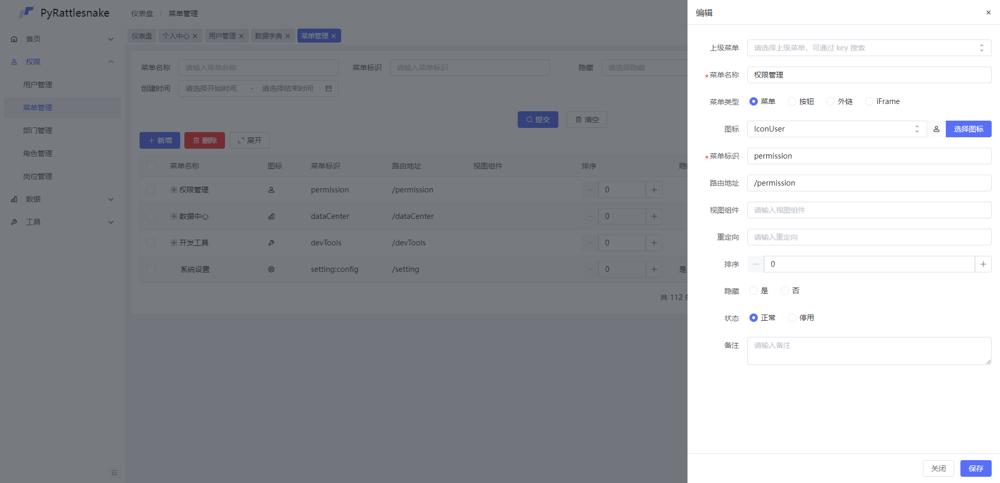
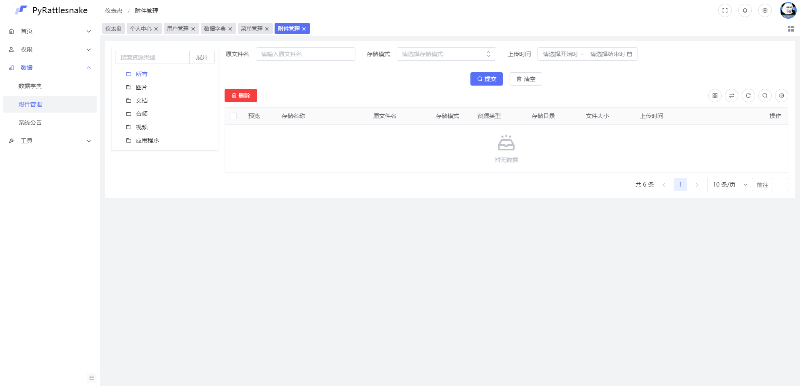
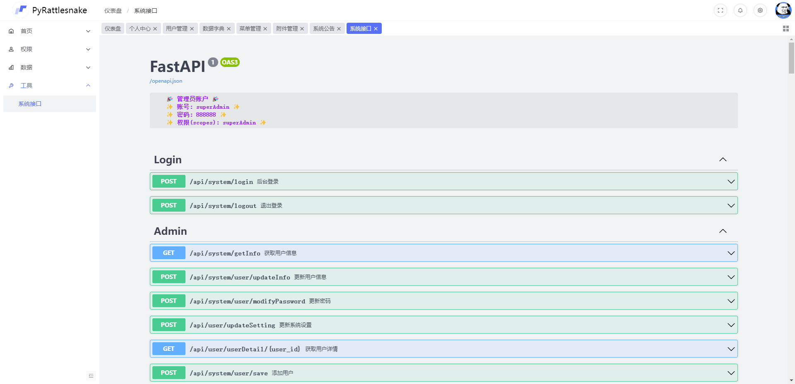

 
 

  <h1 align="center">
    PyRattlesnake Admin FastApi
  </h1>
  <h4 align="center">
    开 箱 即 用 的 前 后 端 分 离 解 决 方 案
  </h4>

    
    

 
<!-- 

  

 -->
 

#### 项目介绍

后端是基于 `fastapi` 的后台管理系统模板，前端扩展沿用`Arco design` —— 字节跳动开源UI样式，大量开源组件，提供便捷快速的开发方式，延续  `fastapi` 的设计风格。基于异步Ajax的菜单构建，多标签页，单标签页的共存，多主题，多布局切换，为开发者提供相对完善的开发方案，只为成为更好的轮子，项目不定时更新

#### 项目预览地址

敬请期待

#### 安装教程

后端启动：

-     进入 backend 目录下
-     python3 main.py

前端启动：

-      进入 frontend 目录下
-      cnpm run dev

#### 开源地址

GitHub 开源地址 ：https://github.com/lvright/PyRattlesnake

#### 项目截图

### 特别鸣谢

- 👉 MineAdmin：https://www.mineadmin.com/

#### 开源贡献

- 欢迎提交 [pull request](https://github.com/lvright/PyRattlesnake/pulls)，注意对应提交对应 `master` 分支

- 欢迎提交 [issue](https://github.com/lvright/PyRattlesnake/issues)，请写清楚遇到问题的原因、开发环境、复显步骤。

## 感谢每一位贡献代码的朋友。

如果对您有帮助，您可以点右上角 💘Star💘支持
